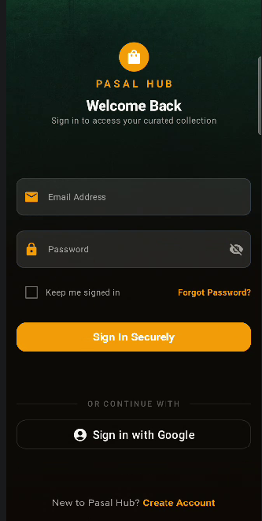
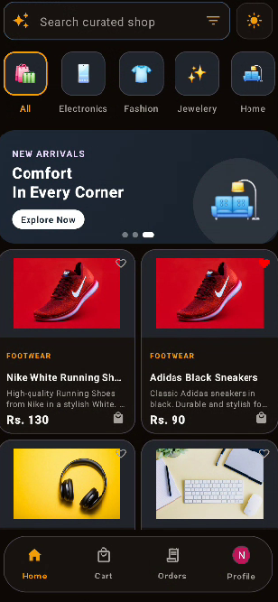
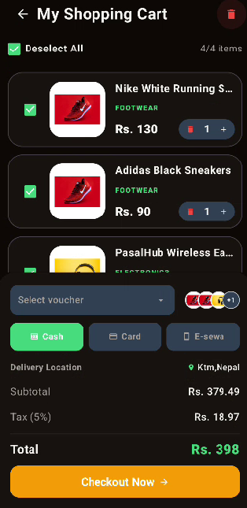
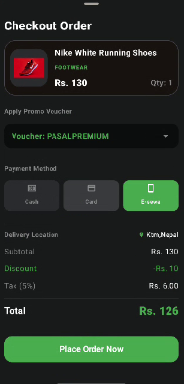
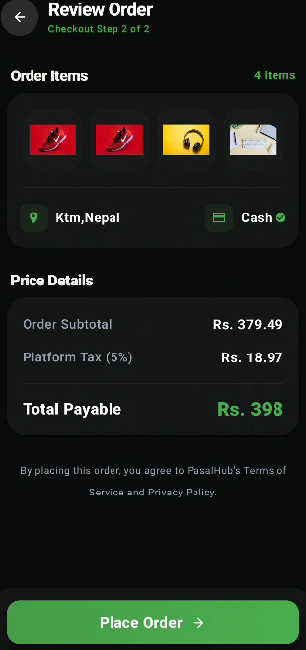
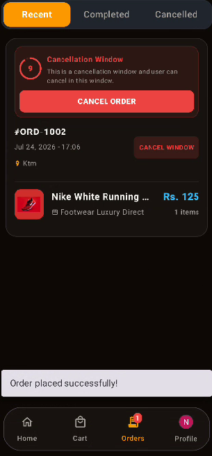
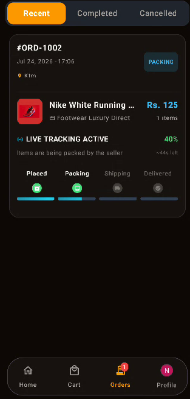
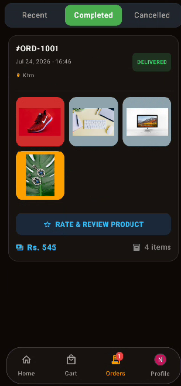
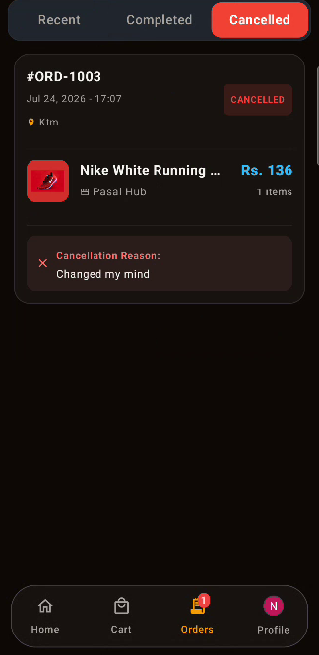
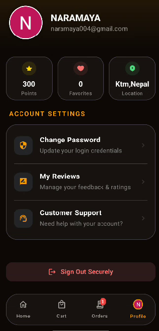

<div align="center">


<br /><br />

<!-- Replace with your actual logo -->
# 🛒 PasalHub

**A next-generation native Android marketplace built for speed, intelligence, and seamless shopping.**
Discover, search, and shop — powered by on-device AI and real-time sync.

[Features](#-features) · [Screenshots](#-screenshots) · [Architecture](#-architecture) · [Getting Started](#-getting-started) · [Contributing](#-contributing)

---

</div>

## 📖 Overview

**PasalHub** is a production-grade native Android e-commerce application. It combines modern mobile architecture with agentic AI workflows and on-device computer vision to deliver a fast, intelligent, and privacy-conscious mobile shopping experience.

Built with scalability and performance at its core, PasalHub follows strict Clean Architecture principles, leverages on-device machine learning for visual product search, and integrates conversational AI to help users find exactly what they're looking for — all while staying offline-first.

---

## 📱 Screenshots

### 🔑 Authentication & Discovery
| Login Screen | Home Dashboard | Product Details |
|:---:|:---:|:---:|
|  |  |  |

### 🛒 Shopping Flow
| My Cart | Checkout | Review Order |
|:---:|:---:|:---:|
|  |  |  |

### 📦 Order Management & Tracking
| Recent Orders | Live Tracking | Completed Orders |
|:---:|:---:|:---:|
|  |  |  |

### 👤 Personalization & Support
| Cancelled Orders | User Profile |
|:---:|:---:|
|  |  |

---

## ✨ Features

### 🤖 AI & Intelligence
- **Gemini AI Conversational Assistant** — Integrated via the Google Gemini API & Function Calling to transform natural language queries into dynamic catalog filtering and personalized recommendations.
- **On-Device Visual Search** — Embedded TensorFlow Lite (MobileNetV3 Small Quantized) model for real-time, privacy-focused image embeddings directly on the client.
- **Smart Recommendations** — Context-aware product suggestions driven by user behavior and conversational intent.

### 📦 Catalog & Orders
- **Real-Time Catalog Sync** — Synchronized with Supabase Realtime (Postgres DB) for instant inventory updates.
- **Multi-Vendor Listings** — Support for multiple sellers (e.g., "Pasal Hub Official", "Luxury Direct") within a unified catalog experience.
- **Live Order Tracking** — Real-time order status updates from checkout to delivery via WorkManager-backed tracking and live progress bars.
- **Dynamic Inventory Management** — Stock levels and price updates reflected instantly across all connected clients.

### 🔐 Security & Auth
- **Google ID & Supabase Auth** — Frictionless onboarding with federated identity and Android Credential Manager support.
- **Secure local state** — Session data managed via robust auth state handling and automatic token refresh.
- **Safe Navigation** — Role-based access and secure routing for sensitive checkout and profile flows.

### ⚡ Performance & UX
- **Offline-First Architecture** — Full browsing and cart functionality without an internet connection via Room Database.
- **Adaptive Layouts** — Responsive Compose UI across phones, foldables, and tablets using Material 3 Adaptive Layouts.
- **Fast Cold Starts** — Baseline Profiles generated for optimized launch times and smooth scroll performance.
- **Agentic System Actions** — Exposes catalog discovery via Android AppFunctions for system-level shortcuts and AI agent interactions.

---

## 🛠 Tech Stack

| Layer | Technology |
|---|---|
| **Language & UI** | Kotlin (2.4.0), Jetpack Compose (Material 3), Adaptive Layouts |
| **Architecture** | Clean Architecture, MVVM, Coroutines, Kotlin Flow |
| **AI / ML** | Google Gemini API (Function Calling), TensorFlow Lite (MobileNetV3), CameraX |
| **Backend & Sync** | Supabase (Postgres, Realtime, Auth), Ktor Client |
| **Local Data** | Room Database (with Paging 3), WorkManager |
| **DI & Testing** | Hilt, Roborazzi (Screenshot Testing), Mockito, JUnit 4, Espresso |
| **Performance** | Baseline Profiles, Macrobenchmark, R8 / ProGuard Optimization |

---

## 🏗️ Architecture

PasalHub follows a **Clean Architecture** pattern with a layered separation of concerns and a **uni-directional data flow (UDF)**. The codebase is organized by feature modules:

```
app/src/main/java/com/psl/pasalhub/
├── ai/                      # Gemini AI integration, AppFunctions, and search routing
├── auth/                    # Login, Register, Forgot Password flows
├── core/                    # Cross-cutting concerns (Database, DI, Networking, Sync)
├── dashboard/               # Core marketplace features (Home, Cart, Orders, Profile)
├── initial/                 # App startup (Splash, Onboarding, Theme)
├── ui/                      # Global theme and design system
└── visualsearch/            # TFLite Visual Search Engine
```

---

## 🚀 Getting Started

### Prerequisites

- [Android Studio](https://developer.android.com/studio) (latest stable)
- JDK 17+
- A [Supabase](https://supabase.com) project & [Google Gemini API key](https://ai.google.dev/)

### Installation

1. **Clone the repository**
   ```bash
   git clone https://github.com/your-username/PasalHub.git
   ```

2. **Configure Secrets**
   Create a `.env` file in the root directory:
   ```properties
   SUPABASE_URL="your_supabase_url"
   SUPABASE_ANON_KEY="your_supabase_anon_key"
   GEMINI_API_KEY="your_gemini_api_key"
   ```

3. **Build & Run**
   Open in Android Studio and run. The `generateLocalKeystore` task will handle debug signing automatically.

---

## 📄 License

```
Copyright 2025 Pasal Hub

Licensed under the Apache License, Version 2.0 (the "License");
you may not use this file except in compliance with the License.
You may obtain a copy of the License at

    http://www.apache.org/licenses/LICENSE-2.0

Unless required by applicable law or agreed to in writing, software
distributed under the License is distributed on an "AS IS" BASIS,
WITHOUT WARRANTIES OR CONDITIONS OF ANY KIND, either express or implied.
See the License for the specific language governing permissions and
limitations under the License.
```

---

<div align="center">

Built with ❤️ using Kotlin & Jetpack Compose

</div>
